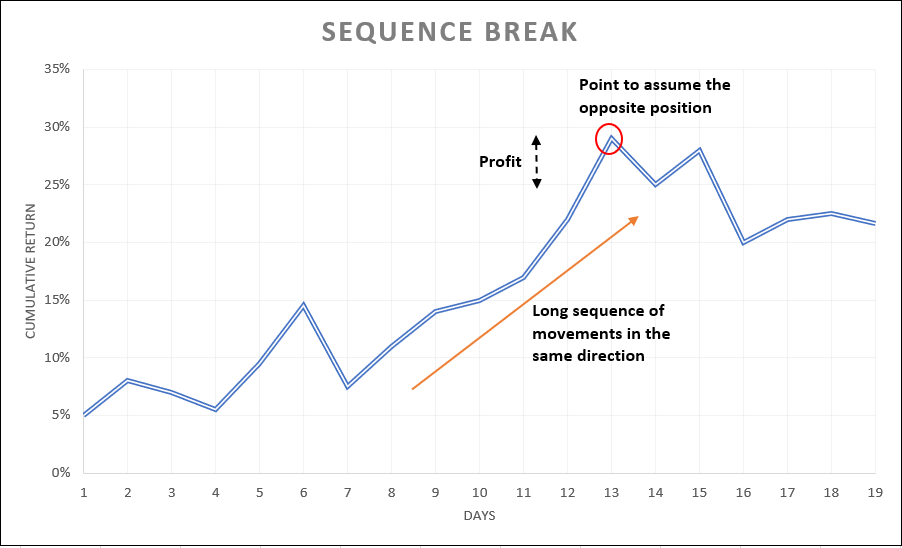

# Quantitative Finance - Sequence Break (Trading Strategy)
Empirically we can observe that a long daily sequence of ups or downs in the stock market are quite rare.
The objective of this study is to build a automatic system that exploits this point by finding stocks with a relatively long daily sequence of one direction movement (based on the stock historical data) and generate signals to assume the opposite position for the next day hoping we can profit with a reverse move.

We will analyse the historical prices of a stock, count the distribution of sequences formed in the past and its probabilities to happen then we will try to generate good signs to buy or sell the stock based on the current sequence of the stock.
For example, if our model learned that a particular stock had only 1% chance of making a 6 streak movement (up or down) and our threshold (confidence) is bigger than 1%, we'll try to find a period when the same stock have a streak of 5 and we'll assume the opposite position. If it has a 5 streak of up movements, we will go short (sell) and if it has 5 streak of down we will go long (buy)

# Backtesting

The most important part was backtesting this trading strategy to see how much return it could give us if it were actually applied (with clear separation between train and test data)
